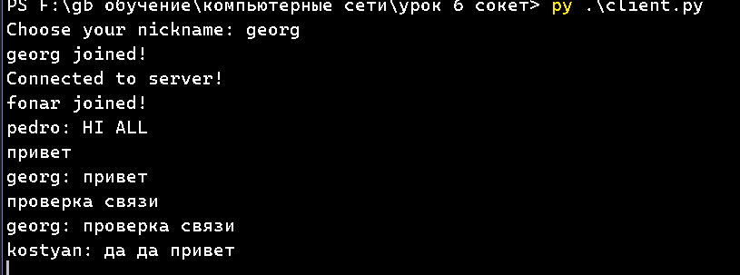
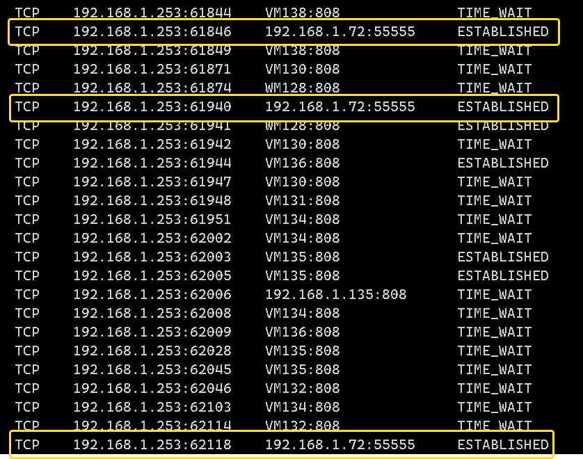
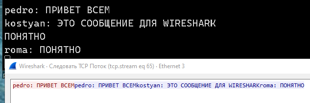

# Компьютерные сети (семинары)
## Урок 6. Основы компьютерных сетей. Транспортный уровень. UDP и TCP.

__Задание:__

1. Напишите свою программу сервер и запустите её. (если опыта в python нет, запустите готовый код и разберитесь, как он работает - файл с кодом готового клиента: https://disk.yandex.ru/d/cAfsjjG_mLqF3A файл с кодом готового сервера: https://disk.yandex.ru/d/qrj4qpiXhXVwgw )
'** попробуйте улучшить код, опишите что сделали, какие фичи добавили.

2. Запустите несколько клиентов. Сымитируйте чат.
   
3. Отправьте мне код написанного сервера (можете через github, если удобно или прямо здесь в txt формате) и скриншоты работающего чата.
   
4. Отследите сокеты с помощью команды netstat. (тоже пришлите скриншот именно сокетов вашего чата)
   
5. Перехватите трафик своего чата в Wireshark и cшейте сессию. Пришлите скриншот сшитой сессии с диалогом.

---
__Решение:__

1.

В существущий код добавил русский язык, улучшил обработку исключений, добавил оставку сервера по сочетанию клавиш.

2.

 

3.

код сервера [server.py](server.py)

4.

 

5.

